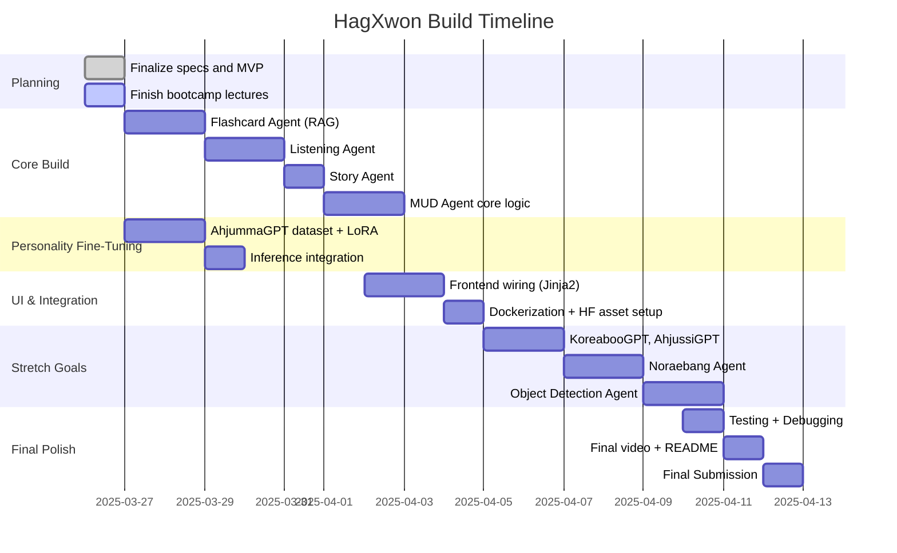

> Note: WIP

# Capstone Project - HagXwon

## 📦 Project Overview

HagXwon is an AI-powered Korean language learning app built for the GenAI Bootcamp. It features multiple AI agents (Flashcard, Listening, Story, MUD) and fine-tuned personalities (AhjummaGPT, AhjussiGPT, KoreabooGPT). Users engage with the language through sassy tutoring, branching narratives, object recognition, and karaoke-inspired practice.

## 🧠 Core Features (Must Deliver)

- ✅ Flashcard Agent with RAG support
- ✅ Listening Agent for TTS/ASR evaluation
- ✅ Story Agent with image support (optional fallback to static images)
- ✅ MUD Game Agent (text-based branching logic)
- ✅ AhjummaGPT personality with fine-tuned model or prompt injection
- ✅ Basic frontend connected to FastAPI backend
- ✅ RAG pipeline with ChromaDB and embedded vocab
- ✅ Dockerized, runnable end-to-end app

## 🌟 Stretch Goals (Time Permitting)

- Noraebang Agent (Lyrics-based quiz/singing)
- Object Detection Agent (camera input → live labels)
- AhjussiGPT and KoreabooGPT fine-tuned models
- UI polish (dropdown tutor selector, animated feedback)
- Hugging Face-hosted prompt templates + vector data

## 🕰️ Tentative Delivery Schedule



## 🧩 Architecture Diagram (High-Level)

```mermaid
graph TD
  UI[User Interface] -->|POST /flashcard| FastAPI
  UI -->|POST /story| FastAPI
  UI -->|POST /listen| FastAPI
  FastAPI -->|Query| ChromaDB
  FastAPI -->|Call| OllamaLLM[AhjummaGPT (via Ollama)]
  FastAPI -->|Load| PromptTemplates[Prompt Templates / HF-hosted]
  ChromaDB -->|Results| FastAPI
  OllamaLLM -->|Response| FastAPI
  FastAPI --> UI
```

## 📁 File Structure (TBD)

```text
project-root/
├── app/
│   ├── main.py
│   ├── agents/
│   ├── prompts/
│   └── templates/
├── rag/
│   └── chromadb_data/
├── data/
│   └── vocab.json
├── Dockerfile
├── docker-compose.yml
├── README.md
├── TechSpecs.md
├── Characters.md
└── MUDGameScript.md
```

```text
hagxwon-capstone/
├── README.md
├── tech-specs/
│   ├── hagxwon-system-architecture.md
│   ├── character-personas.md
│   ├── delivery-gantt.md
│   └── fine-tuning-strategy.md
├── backend/
│   ├── app/
│   └── Dockerfile
├── frontend/
│   ├── templates/
│   └── static/
├── data/
│   ├── vector-db-sources/
│   └── persona-finetuning/
├── journal/
│   ├── 2025-03-25_26.md
├── diagrams/
│   └── napkin-ai/
└── scratchpad/
```

## ✅ To-Do Summary

- [x] Write Tech Specs & Persona Doc
- [ ] Finish lectures
- [ ] Build core agents
- [ ] Run AhjummaGPT LoRA fine-tune
- [ ] Setup RAG (ChromaDB + HF assets)
- [ ] Build MVP UI
- [ ] Dockerize and write final demo script

You’ve got this. Let’s ship it clean. 🚀
