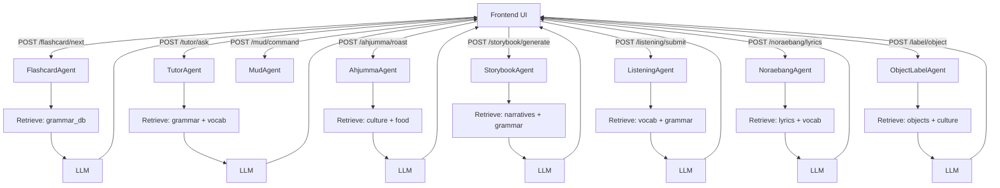
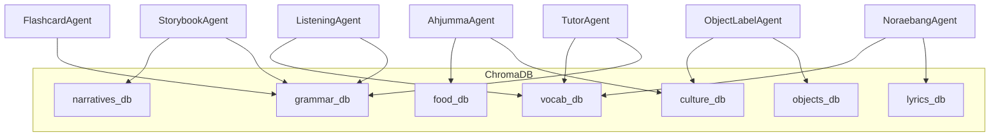

# HagXwon Backend: Master Technical Specification (Bootcamp-Aligned)

This document defines the **backend architecture** for the HagXwon Capstone Project, aligned with GenAI Bootcamp requirements and extended with additional features, agents, and modular components.

---

## 1. Backend Framework & Philosophy

### 🛠 Bootcamp Minimum Requirements

The following are the core backend requirements specified by the GenAI Bootcamp:

- ✅ Must use **FastAPI** (or Flask if specified — this project uses FastAPI)
- ✅ Must use a **relational database** (SQLite3 minimum)
- ✅ Must expose a **working REST API** with JSON inputs/outputs
- ✅ Must be **Dockerized** for grading
- ✅ Must include **vocabulary endpoints** (e.g., `/words`, `/groups`)
- ✅ Must include **study session endpoints** (`/study_sessions`, `/review`)
- ✅ Must implement a **flashcard app** for language learning
- ✅ Must demonstrate **retrieval-augmented generation** (RAG) with basic working flow
- ✅ **No authentication system** required
- 🔁 Fine-tuning is optional
- 🔁 Frontend is optional, but backend must be API-accessible and testable via Swagger or curl

---

- **Framework:** FastAPI (finalized)
- **Bootcamp Requirements Met:**
  - Dockerized backend
  - REST API with multiple endpoints
  - Agent-based modularity
  - Vector DB usage (e.g., Chroma)
- **Project Additions:**
  - Multi-agent personality logic
  - Multi-vector-database structure
  - Flashcard + Tutor + MUD-based agent flows
  - Persona-driven RAG and prompt pipelines
  - JSONL-based fine-tuning support

---

## 2. Core Backend Structure

```
/backend
├── main.py              # App entrypoint
├── agents/              # Modular agents for different tasks
│   ├── flashcard_agent.py
│   ├── tutor_agent.py
│   ├── ahjumma_agent.py
│   ├── mud_agent.py
│   ├── storybook_agent.py
│   ├── listening_agent.py
│   ├── noraebang_agent.py
│   └── object_label_agent.py
├── rag/                 # Embedding + Retrieval modules
│   ├── embed.py
│   ├── retrieve.py
├── data/                # Data processing pipeline
│   ├── pdf_to_text.py
│   ├── chunking.py
│   └── metadata_tags.py
├── db/                  # Traditional (SQLite) DB logic
│   ├── schema.sql
│   └── user_data.py
├── utils/               # Prompt templates and shared helpers
│   ├── prompt_templates.py
│   └── config.py
└── Dockerfile
```

---

## 3. Multi-Agent System Overview

Additional agents based on journal design updates:

| Agent            | Task                            | Input                           | Uses RAG | Vector DB               |
| ---------------- | ------------------------------- | ------------------------------- | -------- | ----------------------- |
| FlashcardAgent   | Vocab & grammar quizzing        | User's TOPIK level              | ✅       | `grammar`               |
| TutorAgent       | Language explanation            | User question + persona         | ✅       | `grammar`, `vocab`      |
| AhjummaAgent     | Judgy food-based feedback       | User input or image             | ✅       | `culture`, `food`       |
| MudAgent         | Story game interaction          | Action verbs                    | ❌       | (internal game logic)   |
| StorybookAgent   | Illustrated story generation    | Seed prompt, age group, persona | ✅       | `narratives`, `grammar` |
| ListeningAgent   | Audio clip + comprehension quiz | Audio input                     | ✅       | `grammar`, `vocab`      |
| NoraebangAgent   | Song-to-vocab and lyric parsing | Song name or lyrics             | ✅       | `lyrics`, `vocab`       |
| ObjectLabelAgent | Real-time object name tutor     | Live webcam input               | ✅       | `objects`, `culture`    |

(Note: These agents can be implemented incrementally. Core agents for submission are FlashcardAgent, TutorAgent, AhjummaAgent, and MudAgent.)

Each agent is autonomous but shares the retrieval and prompt pipeline layer.

---

## 4. Multi-VectorDB Strategy

We divide our data sources into two categories:

### 🔍 Vector Databases (ChromaDB Collections)

These are embedded and queried via RAG:

```
/chroma
├── grammar_db        ← Used by FlashcardAgent, TutorAgent
├── culture_db        ← Used by AhjummaAgent, ObjectLabelAgent
├── food_db           ← Used by AhjummaAgent (triggered by topic)
├── vocab_db          ← Used by TutorAgent, ListeningAgent, NoraebangAgent
├── narratives_db     ← Used by StorybookAgent (vectorized story elements)
├── lyrics_db         ← Used by NoraebangAgent
├── objects_db        ← Used by ObjectLabelAgent
```

Metadata per vector chunk includes:

- `source_type`: grammar, culture, lyrics, food, etc.
- `persona_affinity`: Ahjumma, Sunbae, etc.
- `TOPIK_level`
- `agent_affinity`: (e.g., StorybookAgent, NoraebangAgent)

### 🗃 Static (Relational) Data (SQLite)

These are structured and managed in `/db/`:

- User profiles
- Vocabulary groups and word lists (used by `/words`, `/groups`)
- Study history and session scores (`/study_sessions`)
- Sentence prompt templates
- Flashcard progress and streaks
- Trainer persona definitions and metadata
- System logs, timestamps, and activity records

**Student activity** (progress, scores, session logs) is always stored in relational form. This ensures reproducibility, persistent tracking, and bootcamp compliance.

This separation ensures fast vector search while keeping structured relational logic clean and queryable. All agents retrieve vector context **but rely on static DBs for student state.**

---

## 5. Backend Flowchart



---

## 6. API Endpoint Specification (REST)

### 🧩 Bootcamp-Required Endpoints

These must be implemented and testable for final evaluation:

- `GET /words` → List all vocabulary words
- `GET /groups` → List vocabulary groups
- `GET /groups/{id}` → Retrieve words in a group
- `POST /study_sessions` → Begin new study session
- `POST /study_sessions/{id}/review` → Submit flashcard/session response

### 🔧 Custom Agent Endpoints

These reflect your added multi-agent functionality:

#### Flashcard Agent

- `POST /flashcard/next`
- `POST /flashcard/submit`

#### Tutor Agent

- `POST /tutor/ask`

```json
{
  "user_input": "How do I say 'I want to eat' in Korean?",
  "persona": "AhjummaGPT",
  "topik_level": 2
}
```

#### Ahjumma Agent

- `POST /ahjumma/roast`

```json
{
  "image_input": "base64string",
  "trigger": "handwriting"
}
```

#### MUD Agent

- `POST /mud/command`

```json
{
  "command": "LOOK"
}
```

#### Storybook Agent

- `POST /storybook/generate`

```json
{
  "prompt": "A fox and a tiger go on an adventure",
  "persona": "SunbaeGPT",
  "tone": "gentle"
}
```

#### Listening Agent

- `POST /listening/submit`

```json
{
  "audio_input": "base64string"
}
```

#### Noraebang Agent

- `POST /noraebang/lyrics`

```json
{
  "song_title": "Spring Day"
}
```

#### Object Label Agent

- `POST /label/object`

```json
{
  "image_input": "base64string"
}
```

---

## 7. Visual: Agent-DB Relationship



---

## 8. Fine-Tuning Interface (QLoRA)

| Field         | Description                        |
| ------------- | ---------------------------------- |
| `persona`     | Which trainer (Ahjumma, etc.)      |
| `tone`        | sass, polite, sarcastic            |
| `input`       | User message or prompt             |
| `response`    | Desired personality-grounded reply |
| `TOPIK_level` | Level relevance (1–6)              |

---

## 9. Deployment Stack (Bootcamp Compliant)

**Docker Compose setup:**

- `FastAPI` backend
- `ChromaDB` container
- Optional: `Ollama` container for local embedding/LLM

All packaged in single reproducible `docker-compose.yml`.

---

## 10. Notes & Bootcamp Alignment

✅ All core agents are modular and testable via API\
✅ REST-first architecture supports frontend integration\
✅ Multi-vector database logic enables advanced RAG routing\
✅ All data flow documented for reproducibility and evaluation

---
